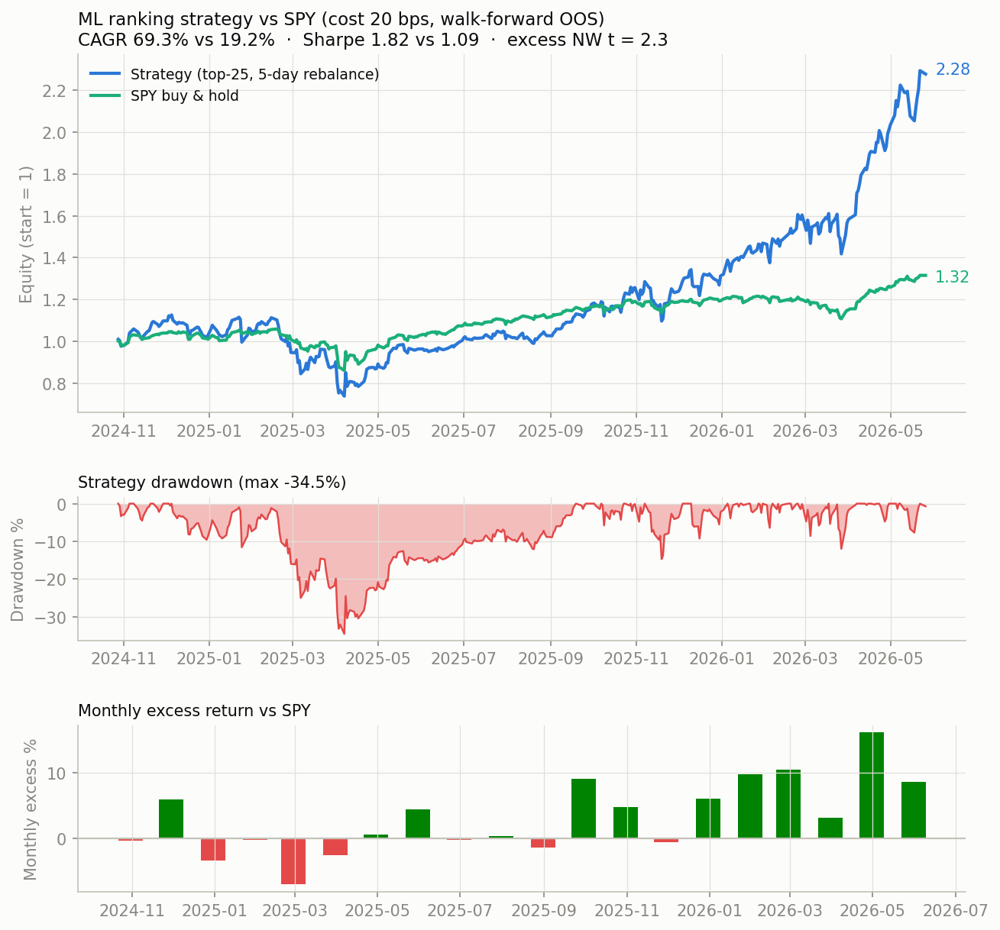

# tail-alpha

**Walk-forward ML ranking on the S&P 500 — where the alpha lives in the tails.**

A cross-sectional stock-ranking pipeline (Alpha158-style features → multi-horizon
GBDT ensemble) with leak-free walk-forward validation, Newey-West significance
testing, and cost-aware portfolio construction. The headline finding is honest:
**the model cannot rank the full cross-section (IC t-stat 0.96), but its tail
picks are statistically significant after costs** (top-25 long portfolio,
NW t = 2.0–2.6 across 10–30 bps cost assumptions).



## Headline results (out-of-sample, 394 trading days, Oct 2024 – May 2026)

Top-25 long portfolio, 5-day staggered rebalance (5 tranches), vs SPY buy & hold:

| Cost (per side) | Strategy CAGR | Sharpe | Max DD | SPY CAGR | Excess NW t |
|---|---|---|---|---|---|
| 10 bps | 77.1% | 2.02 | −33.3% | 19.2% | 2.57 |
| 20 bps | 69.3% | 1.82 | −34.5% | 19.2% | 2.30 |
| 30 bps | 61.8% | 1.62 | −35.7% | 19.2% | 2.04 |

All returns are pure out-of-sample: every score comes from a model that never saw
the day it is scoring (19 walk-forward windows, 12-month train, purge 10d +
embargo 5d against label overlap).

## The story (including the negative results)

1. **A small universe lied to us.** On a 59-stock pool the pipeline showed
   CS-IC ≈ 0.069. Rebuilt on 501 S&P 500 names over 3 years, full-cross-section
   IC collapsed to 0.016 (NW t = 0.96, p = 0.34). Most of the small-pool IC was
   sampling noise — wide cross-sections keep you honest.
2. **But the tails survived.** Top-minus-bottom spread was positive in 16/19
   windows (84%). Daily long-short spread t-stats: k=5 → 2.69, k=25 → 2.14,
   k=50 → 2.05. The long leg alone beats the universe mean at t = 2.4–3.1,
   so the effect is implementable long-only.
3. **Slow trading is (nearly) free.** Holding 5 days instead of rebalancing daily
   cuts turnover from 28%/day to 9%/day and loses almost no gross return — the
   signal's horizon matches its 5-day training label.
4. **Ablation: a dedicated tail classifier loses.** We retrained the model as a
   3-class tail classifier (bottom 20% / middle / top 20%, score =
   P(top) − P(bottom)). Same splits, same evaluation: net excess dropped from
   +39–48%/yr to +9–22%/yr. Class labels throw away magnitude information the
   regression ensemble keeps. **Specialize at the portfolio layer (act only on
   the tails), not at the training objective.** See `reports/tail_model_report.json`.

## Method

- **Features**: ~176 Alpha158-style price/volume factors + cross-asset betas
  (sector ETFs, HYG), gap dynamics, relative strength, macro series (FRED,
  optional `FRED_API_KEY`).
- **Labels**: 1/3/5/10-day forward returns, cross-sectionally demeaned per day
  (market-neutral) — the model learns relative moves, not market timing.
- **Models**: LightGBM / XGBoost / CatBoost per horizon; sub-models filtered by
  validation IC > 0, IC-weighted ensemble, 40% weight cap.
- **Validation**: rolling walk-forward with purge (10d) + embargo (5d);
  significance via Newey-West t on the daily CS-IC and spread series
  (Bartlett kernel, lag 5, correcting for overlapping 5-day labels).
- **Costs**: per-side bps on actual turnover, reported at 10/20/30 bps.

## Reproduce

```bash
pip install -r requirements.txt

# 1. Data + walk-forward validation (~2-3h; downloads via yfinance)
python ml_pipeline.py --universe sp500 --period 3y --neutralize-labels

# 2. Ablation: tail classifier vs regression ensemble
python research_tail_model.py

# 3. Portfolio report: equity curve vs SPY, drawdown, monthly excess
python research_portfolio_report.py
```

The S&P 500 membership snapshot is pinned in `data/sp500_snapshot.csv`
(fetched 2026-07-01) so runs are reproducible.

## Limitations — read before believing

- **Regime concentration.** Excess returns concentrate after Dec 2025
  (segmented spread t: 0.58 before, 3.13 after). The tails were roughly flat for
  the first 13 months. This may be regime-dependent momentum, not a constant edge.
- **Survivorship bias.** The universe is today's S&P 500 membership backtested
  over 3 years (~4% annual index churn). This flatters the results modestly.
- **Execution assumptions.** Signals use day-t closes and assume fills at the
  same close; no borrow costs (long-only mitigates), no market impact beyond
  the bps model.
- **Sample size.** 394 OOS days is enough for t-stats, not for certainty.
  A t of 2.0–2.6 is evidence, not proof.

## Layout

| Path | What |
|---|---|
| `ml_pipeline.py` | Data generation, walk-forward training, significance report |
| `ml_model_registry.py` | Model wrappers (LGB/XGB/CatBoost, ranking utils) |
| `double_ensemble.py` | DoubleEnsemble-style sample reweighting |
| `cross_sectional_evaluator.py` | Daily IC / top-k spread metrics |
| `research_universe.py` | S&P 500 snapshot loader (pinned CSV) |
| `research_tail_model.py` | Tail-classifier ablation |
| `research_portfolio_report.py` | Cost-aware portfolio backtest + charts |
| `factors/` | Alpha158 + extended + macro feature engineering |
| `reports/` | Frozen result artifacts backing the tables above |

## License

MIT
